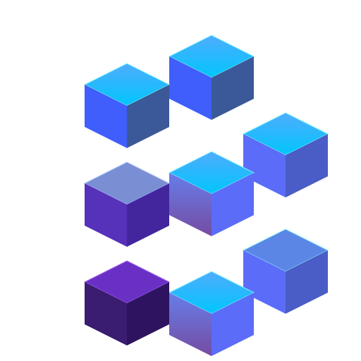

# clairgrid

PROOF OF CONCEPT

Currently, clairgrid is an experimental web application focused on data management.

The research behind clairgrid aims to develop a robust engine for data structuring, relationship management, presentation, and, most importantly, intuitive data navigation.

This innovative application requires no database knowledge or skills, as all aspects are managed in real time through a simple, web-based user interface.

Primarily designed for small businesses, the application enables the management of diverse and extensive organizational information, facilitating easy and natural sharing among stakeholders using only a web browser.

clairgrid also serves as the foundation for developing a comprehensive business-oriented application development toolkit.

Copyright David Lambert 2025

# Techstack

1. Docker: https://www.docker.com/
1. Postgresql: https://www.postgresql.org/
pgvector for Postgreql: https://github.com/pgvector/pgvector

1. Svelte: https://svelte.dev/
1. Flowbite Svelte: https://flowbite-svelte.com/
1. Tailwindcss: https://tailwindcss.com/
1. Python
1. RabbitMQ

# Installation

1. Create a file `adminConfiguration/.db-password` with the password used for accessing the Postgresql instance
1. Create a file `adminConfiguration/.root-password` with the password set for the user created with administrator privileges

```sql
-- initial password set for the user created with administrator privileges
-- password should be base64-encoded AND encrypted
-- password is temporarly and needs to be changed after first login
-- to generate a password, log to a PostgreSQL database
-- then enter:
CREATE EXTENSION IF NOT EXISTS pgcrypto;
SELECT crypt(encode('*****', 'base64'), gen_salt('bf', 8));
```

1. Create a file `adminConfiguration/.rabbitmq-password` with the password used for accessing the RabbitMQ instance

1. Create a file `adminConfiguration/.jwt-secret` with the secret key used to generate JWT tokens. Use the same approach as for `adminConfiguration/.root-password` file.

## History

2007 - Project factory (https://sourceforge.net/projects/projectfactory/). As an open source project for project management, Factory lets you organize actors in teams, define projects, create version-based plans, generate forecast calendars and track statuses. Small and stand alone, it runs on every system with Java.

2012 - Prototype using Ruby on Rails and sqlite3 . First attempt to make somthing entirely generic and dynamic. The implementation of row-level security came very late and turned to be impossible to make.

2022 - Prototype using Docker, Go, Go-gin, React and Postgreqsl. Adopting Go was great, but React wasn't. The code for the UI was a mess. The traditional approach as a monolith was a mistake.

2025 - Encoon (https://github.com/ddlamb2000/encoon). Prototype using Docker, Go, Kafka, Postgreqsl and Svelte. Adoption an event-based architecture using Kafka. Svelte is sweet.

## Notes for developers

- Look at https://vitest.dev/ for unit testing
- Look at https://playwright.dev/ for E2E testing
